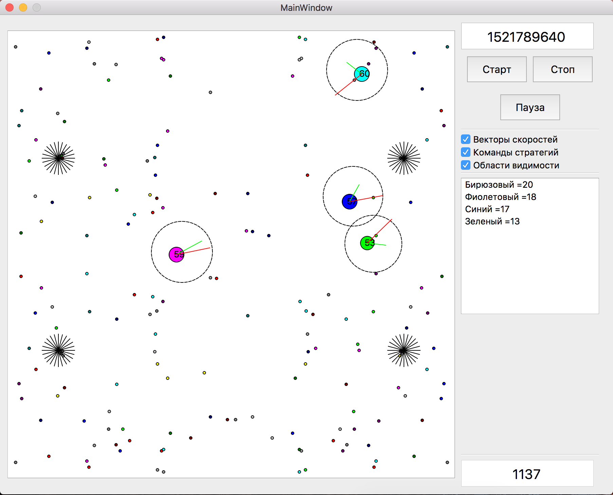
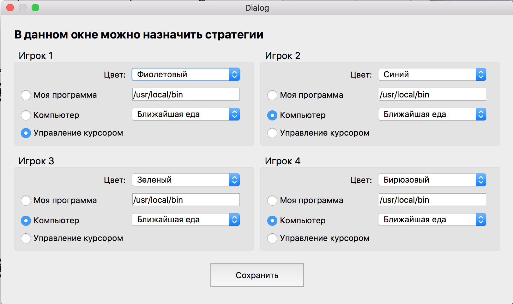

# Правила участия в AiCups 2

Соревнование среди создателей искусственного интеллекта наконец-то стартует во второй раз. Теперь мы предлагаем участникам написать своего **бота**, который сойдется в сложной битве против трёх других **ботов** в мире, напоминающем известную игру [Agar.io](http://agar.io/).

Мероприятие проводится на специально разработанной онлайн-платформе [AiCups](http://aicups.ru/), где участники регистрируются, могут отправлять решения, стартовать **игры** и узнавать актуальные новости. Каждая игра принадлежит к классу рейтинговых, либо нерейтинговых. Нерейтинговые игры участники стартуют сами, они предназначены лишь для оценки собственных сил и отладки написанных ботов в боевом окружении. Рейтиновые игры система время от времени стартует самостоятельно, подбирая участников по алгоритму TrueSkill. По результатам рейтинговых **игр** формируется итоговый рейтинг и определяются победители. Каждая **игра** запускается на серверах организатора в изолированном окружении. Попытки вредительских действий будут рассматриваться как нарушение данных правил и приведут к скорейшему бану и выпилу "незадачливого хакера".

Решения можно присылать на любом языке программирования из списка поддерживаемых:
* Python версий 2.7 или 3.5
* C++ для компилятора GCC версии 4.8 и стандарта 2011 года (С++11)
* Java версии 1.8
* ECMAScript 6, с использованием NodeJS 9
* C# с использованием Mono 4.3
* PHP версии 7
* Go для компилятора версии 1.6

Детальные инструкции по созданию решения, формату входных и выходных данных, сопутствующих пакетах и библиотеках можно прочитать в [разделе 2](#2-Создание-решения). После того как решение было загружено, его результат можно посмотреть в визуализаторе на сайте. Попутно будут выводиться отладочный вывод, отладочные спрайты и случившееся ошибки.

Для удобства участников, а также для снижения пиковых нагрузок на систему запуска, мы подготовили программу для локального запуска и отладки - (**local runner**). Она написана на С++11 и Qt5 и поставляется в виде скомпилированного файла и исходных кодов. Детальные инструкции по настройке и использованию Вы найдете в [разделе 3](#3-Работа-с-local-runner-ом).

С организаторами соревнования можно связаться:
 * в группе telegram [@aicups](https://t.me/aicups)
 * с помощью формы обратной связи на сайте соревнования  

Удачи!

*Все числовые параметры, которые вы встретите ниже даны как примеры. В каждой конкретной игре параметры могут быть немного изменены, что повлияет на игровой баланс и физику мира. Таким образом мы получаем более справедливый и предсказуемый рейтинг раундов. Конкретные параметры игры будут присылаться ботом перед первым тиком (см. раздел 2).*


## 1. Описание механики

Игровой мир представляет собой квадрат со сторонами 990 на 990 условных единиц (параметры конфигурации GAME_WIDTH, GAME_HEIGHT). Начало отсчета расположено в левом верхнем углу. Все координаты в мире вещественного типа, но для визуализации они приводятся к целым числам. В мире существует симметрия относительно двух осей, которые проходят через центр параллельно сторонам, и появление всех новых игровых объектов ("спаун") учитывает эти оси - смотри рис. 1.

Рисунок 1. Мир (в LocalRunner-е размеры по умолчанию уменьшены до 660х660)


В соответствии с рисунком, при спауне новые объекты появляются четвёрками, симметрично относительно осей симметрии.

Одновременно на одной карте соревнуются четыре **бота**, созданных участниками соревнования. Каждому **боту** соответствует игровой объект типа "Игрок" (в начале игры один, в процессе их может стать больше). Игра продолжается строго заданное число игровых тиков (7500, 25000, 40000) (параметр конфигурации GAME_TICKS). Каждый тик выполняется по чёткой схеме:
 * **ботам** передаётся состояние мира и в ответ ожидаются команды - координаты точки, куда двигаться соответствующему "игроку", плюс дополнительные игровые действия;
 * каждая полученная команда тут же будет применена;
 * при получении всех команд просчитывается новое состояние мира (движения, поедания, "взрывы" и другие взаимодействия);
 * за определенные действия начисляются игровые очки и тот, кто наберет наибольшее количество очков к концу игры - станет победителем.

Каждый игровой объект обладает уникальным в пределах мира идентификатором числового типа.

### 1.1. Игровые объекты и концепции

1. **Еда (Food)** - неподвижные объекты, которые появляются на карте в случайных местах в результате постоянного спауна (раз в 40 тиков). Всего на карте их может быть до 2000 единиц. Могут быть съедены игроками и тогда масса еды (параметр конфигурации FOOD_MASS), приплюсуется к массе игрока. Если два игрока приблизились к еде за один тик и потенциально могут её съесть, то преимущество у того, кто находится ближе.
Радиус еды = 2.5.
Масса еды = 1.0 единиц (параметр конфигурации FOOD_MASS).

2. **Вирус (Virus)** - большую часть времени это неподвижные объекты, изображаемые в localrunner как черные "кусты". Появляются на карте в результате довольно редкого спауна (раз в 1200 тиков) либо в результате деления. Могут поглощать выбросы массы (о них - ниже) и накапливать массу. При достижении критической массы в 70 единиц (параметр конфигурации VIRUS_SPLIT_MASS), отпочковывается новый вирус по направлению последнего выброса массы. Также Игроки с достаточно большой массой (от 120 единиц) и радиусом большим, чем радиус вируса, при наезде на вирус спровоцируют "Взрыв".
Радиус вируса = 22.0 (параметр конфигурации VIRUS_RADIUS).
Начальная масса вируса = 40.0.

3. **Игрок (Player)** - двигающийся активный объект, который управляется **ботом** участника. Максимальная скорость зависит от массы и рассчитывается как ```max_speed = SPEED_FACTOR / sqrt(mass)``` (т. е. чем больше масса, тем медленнее игрок передвигается по карте). Игрок может поедать еду, выбросы или других игроков, при условии, что его масса больше массы "жертвы" хотя бы в 1.2 раза.
Также Игрок, при наличии достаточной массы (минимально 120 единиц), может делиться на **фрагменты** двумя способами:
 * по команде участника (на два равных по массе);
 * при наезде на вирус (на много равных по массе мелких фрагментов, в зависимости от исходной массы).
Всего у одного игрока может быть до 16 отдельных фрагментов (задается в конфиге переменной MAX_FRAGS_CNT) и через определенный промежуток времени (150-500 тиков, TICKS_TIL_FUSION) близко-находящиеся фрагменты имеют возможность слиться обратно в один. До этого момента фрагменты отталкиваются друг от друга.
Начальная масса игрока = 40.0;
Начальный радиус игрока = ```2 * sqrt(40.0)```.

4. **Выброс (Ejection)** - неподвижные объекты, создаваемые игроками. Могут использоваться, к примеру, для подкормки вирусов или для перераспределения массы между своими фрагментами.
Масса выброса = 15.0.
Радиус выброса = 4.0.

5. **Туман войны (Fog of war)** - большая часть карты скрыта от **ботов** туманом войны. Пространство обзора имеет форму круга с небольшим сдвигом (сдвиг фиксирован и равен 10) от центра Игрока в сторону движения. Радиус обзора зависит от радиуса Игрока (который в свою очередь зависит от массы как ```radius = 2 * sqrt(mass)```) по формуле ```4 * radius```. При количестве фрагментов больше одного, радиус обзора каждого из фрагментов рассчитывается по формуле: ```radius = 2.5 * radius * sqrt(fragments.count())```. Туман войны означает, что боты получат информацию только о тех игроках, еде и выбросах, которые хотя бы частично попали внутрь радиуса обзора, с одним исключением - вирусы видны всем отовсюду.


### 1.2. Игровые взаимодействия

0. **Управляемое движение (Move)** - доступно для игроков и их фрагментов. Подвержено инерции (направление и величина скорости меняется не сразу, а за несколько тиков) и ограничено максимальной скоростью. Инерция рассчитывается как изменение текущих проекций скорости:
```
speed_x += (nx * max_speed - speed_x) * INERTION_FACTOR / mass;
speed_y += (ny * max_speed - speed_y) * INERTION_FACTOR / mass;
```
где `nx` и `ny` - это проекции на оси единичного по модулю вектора направления (вектор между текущим положением и точкой, в которую приказывает ехать **бот**). Такие законы движения дают правдоподобное поведение - разгон, торможение, повороты - всё с учетом инерции и текущей массы.

1. **Поедание (Eat)** - приводит к накоплению массы и уничтожению съеденного объекта. Игроки поедают еду, выбросы и других игроков. Вирусы поедают выбросы. Масса съеденного объекта приплюсовывается к массе хищника. За один тик можно съесть неограниченное кол-во других объектов, главное чтобы они попали во внутреннюю зону съедающего и по массе были меньше в 1.2 раза. Перекрытие не обязательно должно быть полным. Достаточно, чтобы хищник закрывал жертву на 2/3 его диаметра.

2. **Выбрасывание массы (Eject)** - могут делать только игроки. Выполняется по команде от **бота** (Eject **игнорируется**, если команда содержит Split=true). За один тик можно выполнить один раз. При этом масса игрока уменьшается на величину массы выброса (15 единиц). Если у игрока много фрагментов, то команду выполнит каждый из них, имеющий достаточную массу (хотя бы 40 единиц). Выброс улетит вдоль текущего вектора скорости с фиксированной начальной скоростью (= 8.0). Вязкость среды через некоторое количество тиков затормозит выброс: ```speed -= VISCOSITY``` до тех пор, пока скорость не станет 0. Аналогично вязкость работает и для других неуправляемых игровых объектов (игроки и вирусы после деления).

3. **Деление (Split) и слияние (Fuse)** - деление выполняется игроками по команде от **бота** либо вирусом, после достижения критической массы. Игрок делится на два равных по массе фрагмента, причем новый фрагмент приобретает дополнительный фиксированный импульс (нач. скорость равна 8.0 независимо от массы) вдоль текущего вектора скорости. Пока этот импульс не исчерпался из-за вязкости среды, фрагмент игнорирует команды, которые к нему приходят и летит по прямой. При этом он может поедать игровые объекты или взрываться на вирусах.
Деление вирусов почти такое же, как и у игроков. Они вылетают с импульсом (= 8.0), вдоль направления последней "подкормки" и останавливаются из-за вязкости среды. Во время движения вирусы могут взрывать игроков и поедать выбросы, которые встретятся им на пути. Друг с другом вирусы не взаимодействуют.  
После деления у игроков запускается таймер слияния (250 тиков, параметр конфигурации TICKS_TIL_FUSION). Пока таймер не истек, фрагменты будут отталкиваться друг от друга при соприкосновениях. Затем они сольются в одного большого игрока (масса суммируется), однако для этого они должны находиться рядом друг с другом ```dist < R1 + R2```. Если фрагменты удалены друг от друга, то они не сольются.

4. **Взрыв (Burst)** - происходит с игроками, набравшими достаточную массу (120 единиц) и достаточный радиус (больший, чем радиус вируса) при пересечении вируса (должно быть перекрытие 2/3 радиуса вируса, то есть `dist < virus_rad * 0.66 + player_radius`). При взрыве получается N фрагментов с массой около или больше 60 единиц, которые разлетятся веером с импульсом как при "делении". Имеется ограничение сверху на количество фрагментов (10 штук, параметр конфигурации MAX_FRAGS_CNT) и работают те же правила "слияния".  
Также стоит отметить, что можно взрываться и делиться столько, сколько позволяет масса и ограничение на кол-во фрагментов. Таймер слияния запускается свой для каждого нового фрагмента, поэтому "слияния" будут происходить в обратном порядке.
Кол-во новых фрагментов вычисляется по следующему алгоритму:
```python
new_frags_cnt = int(mass / MIN_BURST_MASS) - 1
max_cnt = MAX_FRAGS_CNT - yet_cnt
if new_frags_cnt > max_cnt:
    new_frags_cnt = max_cnt
```
, где параметр MIN_BURST_MASS равен 60.0 единицам.
Предусмотрен бонус к массе за взрыв на вирусе, изначальный Игрок получит +5 единиц к массе перед собственно "взрывом" на фрагменты.

5. **Уменьшение массы со временем (Shrink)** - как и в оригинальном AgarIO, для игроков набравших большую массу предусмотрена потеря массы со временем. Каждый 50-ый тик все игроки с массой больше 100 единиц будут терять 1% от избыточной массы - ```mass -= (mass - 100) * 0.01```.


### 1.3. Условия победы

Игра длится фиксированное число тиков, однако, она завершится раньше, если на карте остался всего один **бот** с количеством очков, достаточных для победы. Если очков не хватает, то игра одного **бота** продолжится, чтобы можно было добрать очков.

Очки присваиваются за определенные игровые действия:
* съесть еду либо чужой неуправляемый выброс (`Eject`) - 1 балл
* съесть фрагмент противника - 10 баллов
* съесть противника полностью - 100 баллов
* взрыв на вирусе - 2 балла

Список игровых действий может пополняться и изменяться для разных раундов соревнования.


## 2. Создание решения

Решение пользователя - это программа-бот, которая взаимодействует с *надсистемой* через потоки стандратного ввода-вывода. Она может быть написана на любом языке из списка поддерживаемых. Для каждого языка будут доступны стандартная библиотека, библиотека для разбора JSON, и дополнения, предложенные участниками. Приветствуются pull-request-ы в [репозиторий соревнования](https://github.com/MailRuChamps/miniaicups/tree/master/agario/dockers).

Решение предоставляется участником на сайте соревнования как ZIP-архив, внутри которого обязательно есть файл с названием main, корректный для выбранного участником языка программирования. Последнее включает в себя:
 * корректное расширение (.py для python, .cpp для С++ и т. д.)
 * корректный синтаксис (к примеру, внутри С++ должна быть функция main()),
 * корректные подключения других модулей/пакетов выбранного языка  

После загрузки решение будет сначала скомпилировано (для компилируемых языков: C++, Go, Java, C#), а затем запущено в специальном docker-контейнере. В отличие от прошлого конкурса, взаимодействие решения с внешним миром происходит не через вызовы API (которые работали как tcp-клиент), а через потоки ввода-вывода (которые используются отдельным tcp-клиентом на С++), что упростило как разработку, так и (во всяком случае надеемся на это) создание решений. Для понимания, смотри рисунок 2.


В данных правилах мы разберем минимальное решение на языке python версии 2.7.


### 2.1. Архитектура решения

Простейшее решение на python будет состоять из одного-единственного скрипта **main.py**. Tcp-клиент инициирует сессию и запускает этот скрипт в самом начале своей работы. Сам по себе tcp-клиент является простым proxy между игровой механикой и решением участника, который скрывает внутри работу с сетью и обработку ошибок. Tcp-клиент просто передаёт json от мира в стандартный поток ввода и забирает ответ из стандартного потока вывода (в python это **sys.stdin** и **sys.stdout**). Отметим, что для корретной работы системы все решения запускаются с настройками "небуфиризуемого ввода-вывода" (в python это флаг -u при запуске интерпретатора).

Решение стартует один раз в самом начале и дальше крутится в бесконечном рабочем цикле. Обрабатывать остановку не обязательно, так как в конце игры dockerd просто "прибьёт" все контейнеры. Внутри цикла - обработка ввода-вывода, парсинг json и вызов главного обработчика:

```python
import json

class Strategy():

	def run(self):
		# получение конфигурации игрового мира
    	config = json.loads(raw_input())

    	# рабочий цикл
    	while True:
    		# получение состояния
        	data = json.loads(raw_input())

        	# основная обработка
        	cmd = self.on_tick(data, config)

        	# отправка результата
        	print json.dumps(cmd)
```

Класс стратегии в этом примере нужен только для "чистоты" и "самоописательности" кода.
После старта игры, сервер-механика рассылает всем подключившимся решениям конфигурацию игрового мира. В неё входят параметры, варьируемые от игры к игре, а именно:

* ключи GAME_WIDTH и GAME_HEIGHT - размеры мира (int);
* GAME_TICKS - длительность игры в тиках (int);
* FOOD_MASS - масса еды (float) (меняется от 1.0 до 4.0);
* MAX_FRAGS_CNT - максимальное количество фрагментов у одного игрока (int) (от 4 до 16);
* TICKS_TIL_FUSION - кол-во тиков после деления или взрыва, когда можно слить фрагменты (int) (от 150 до 500);
* VIRUS_RADIUS - радиус вируса (float) (от 15.0 до 40.0);
* VIRUS_SPLIT_MASS - критическая масса, по достижению которой вирус поделится (float) (от 50.0 до 100.0)
* VISCOSITY - вязкость среды, от которой зависит скорость замедления вирусов, выбросов и фрагментов после деления (float) (от 0.05 - наименьшая вязкость, до 0.5)
* INERTION_FACTOR - параметр регулировки инерции (насколько быстро изменяется вектор скорости при смене направления) (float) (от 1.0 - наибольшая инерция, до 20.0)
* SPEED_FACTOR - параметр регулировки максимальной скорости (float) (от 25.0 до 100.0 - космические скорости)

Пример конфигурации мира в `json`:
```
{"FOOD_MASS":1,"GAME_HEIGHT":660,"GAME_TICKS":75000,"GAME_WIDTH":660,"INERTION_FACTOR":10,"MAX_FRAGS_CNT":10,"SPEED_FACTOR":25,"TICKS_TIL_FUSION":250,"VIRUS_RADIUS":22,"VIRUS_SPLIT_MASS":80,"VISCOSITY":0.25}
```

Решение может проанализировать эту конфигурацию и как-либо "подготовиться" к игре. От момента подключения всех 4 участников, до момента старта, гарантированно пройдет 20 секунд затишья.

Затем начинается игра. Мир проигрывает фиксированное число тиков в цикле, асинхронно отправляя подключенным tcp-клиентам своё текущее состояние, сериализованное в json. Состояние включает в себя только те игровые объекты, которые видны соответствующему игроку (см. туман войны), а также детальную информацию о фрагментах самого игрока: помимо физических параметров, еще и их скорость и таймеры слияния.

Ответ на один тик не должен превышать 5 секунд. Суммарное время ответов за всю игру не должно превышать 150 секунд для 7500 тиков. Время игр с большим количеством тиков будет уточнено дополнительно перед стартом соответствующих раундов.


### 2.2. Формат передаваемых данных

Входные данные представляют собой строку-json с такой структурой:
```javascript
{
    // объекты, подконтрольные участнику (фрагменты)
    "Mine": [

        // пример моего фрагмента
        {
            // уникальный идентификатор (string)
            // для игроков через точку записывается номер фрагмента (если есть)
            "Id": "1.1",

            // координаты в пространстве (float)
            "X": 100.0, "Y": 100.0,

            // радиус и масса (float)
            "R": 8.0, "M": 40.0,

            // скорость в проекциях Ox и Oy (float)
            "SX": 0.365, "SY": 14.0,

            // таймер слияния (int) (если есть)
            // "TTF": 250,
        },

        // другие фрагменты аналогично
        ...
    ],

    // объекты, видимые участнику (другие игроки, вирусы, еда, выбросы)
    "Objects": [

        // пример игрового объекта - еды
        {
            "X": 200.0, "Y": 200.0,

            // тип объекта (string) (F=Food)
            "T": "F"
        },

        // пример игрового объекта - выброса
        {
            "X": 300.0, "Y": 300.0,

            // тип объекта (string) (E=Ejection)
            "T": "E",

            // идентификатор хозяина выброса
            "pId": 1
        },

        // пример игрового объекта - вируса
        {
            // идентификатор объекта (string)
            "Id": "153",

            "X": 400.0, "Y": 400.0,

            // масса конкретного вируса (float)
            "M": 60.0,

            // тип объекта (string) (V=Virus)
            "T": "V"
        },

        // пример игрового объекта - чужой игрок
        {
            // идентификатор объекта (string)
            "Id": "2",

            "X": 150.0, "Y": 150.0,

            // масса и радиус (float)
            "M": 60.0, "R": 10.0,

            // тип объекта (string) (P=Player)
            "T": "P"
        },

        // другие объекты аналогично
        ...
    ]
}
```

О своих фрагментах бот знает больше информации (скорость и таймер слияния), чем о чужих.

Все передаваемые данные типа float не ограничены в точности, то есть будут переданы так, как они рассчитаны в игре-механике, без округлений. Для вирусов и игроков предоставляются их игровые идентификаторы для специальных возможностей отладки (об этом ниже).

Предполагается, что этих данных достаточно участникам для принятия решения об управлении своими фрагментами.

Пример выходных данных представлен ниже:

```javascript
{
    // направление движения в виде конечной точки;
    // фрагменты будут подстраивать свои скорости (в соответствии с инерцией и остальной физикой),
    // чтобы приехать в указанную точку;
    "X": 123.0,
    "Y": 117.0,

    // отладочный вывод, который попадет в консоль браузера при визуализации;
    // максимум 1000 символов, все остальное будет обрезано;
    "Debug": "No food",

    // выполнить деление, выброс
    // "Split": true,
    // "Eject": true,

    // отладочный вывод в спрайт, который будет прикреплен в визуализаторе к игроку;
    // здесь как раз и нужны переданные во входных данных идентификаторы;
    "Sprite":
    {
        "Id": "1.1",
        "S": "Mass 50" // максимум 40 символов
    }
}
```

Данная команда определит поведение подконтрольных игроков и фрагментов на текущий тик. Она применится к ним ко всем с ограничениями на взаимодействия, описанные выше.

Выходные данные обязательно должны содержать ключи "X" и "Y". Всё остальное является опциональным.


## 3. Работа с local runner-ом

Local Runner поставляется в виде открытых исходных кодов на языке программирования С++ стандарта 11-го года. Чтобы его скомпилировать, понадобится компилятор с поддержкой современных возможностей и библиотека Qt версии 5.6 или выше. Для основных операционных систем (Windows, MacOS, Linux) будут скомпилированы и выложены исполняемые файлы, как на официальном сайте чемпионата, так и в официальном репозитории. Эта программа служит для демонстрации механики (аналогичный код работает у нас на серверах) и для того, чтобы пробовать свои решения на собственном локальном компьютере.

Пользовательский интерфейс программы выглядит также, как на рисунке ниже:



Большое белое поле с разноцветными игровыми объектами. У игроков можно просматривать их скорости, направление (то же что и команды **ботов**) и области видимости (пунктиром вокруг). В правой части отображается SEED генератора случайных чисел (редактируемый), текущий тик, и очки каждого игрока. Также имеются кнопки для старта новой игры ("Старт"), удаления игры ("Сброс") и паузы.

В Local Runner-е предусмотрен уже написанный **бот** для экспериментов. Его стратегию можно описать в паре слов как: "ездить по квадрату и если увидел еду - хватай ближайшую". Бот не анализирует других игроков или вирусы и наталкивается на них случайно. Иногда бот может делиться.

После того как вы попробуете написать своего **бота**, его можно подключить к local runner-у с помощью меню "Стратегии" -> "Назначить". Вам откроется такое модальное окно:



**Внимание!**  
Под командой запуска имеется в виду именно команда запуска - то, как вы сами запустили бы на машине свою программу, со всеми путями итп. Очень частой ошибкой участников являются попытки использовать к примеру `main.py` вместо `python ПУТЬ/main.py` или `main.cs` вместо пути к скомпилированному бинарнику.  
Здесь нужно выставить галку "Моя программа" и написать команду запуска (exec). Local Runner запустит вашего **бота** в отдельном процессе также как и наша серверная система запуска, с тем же форматом ввода-вывода и ограничениями на время и длину ответа. Запуск будет выполнен после закрытия модалки и нажатия на "Старт".  
**Важно!** Не забывайте про буферизацию ввода-вывода в вашем инструментарии (к примеру, интерпретатору python нужно передать флаг -u или выставить соответствующую переменную окружения), без этого, корректная работа не гарантирована.  

**Перечень частых случаев запуска для разных ЯП**
 * python: `python -u FULLPATH/main.py`  

С интерпретируемыми языками в windows бывают случаи, когда интерпретатор установлен не совсем верно, и его нет в системной переменной PATH. В этом случае необходимо указывать полный путь к интерпретатору любимого языка.

Еще можно попробовать поиграть руками. Переключив одного из игроков на управление "клавиатура-мышь" вы сможете прочувствовать себя в роли бота. Мышкой отдавайте команды на движение, а клавишами W и Space можно выбрасывать массу и делиться соответственно. В таком режиме очень удобно изучать мир, его объекты и взаимодействия.

Local Runner поддерживает переопределение параметров мира с помощью переменных окружения. Названия переменных соответствуют названиям, даваемым выше в описании мира и тем ключам, которые передаются в конфигурации мира. Полный список: GAME_TICKS, GAME_WIDTH, GAME_HEIGHT, FOOD_MASS, MAX_FRAGS_CNT, TICKS_TIL_FUSION, VIRUS_RADIUS, VIRUS_SPLIT_MASS, VISCOSITY, INERTION_FACTOR, SPEED_FACTOR.


## Спасибо, что участвуете в наших чемпионатах!
