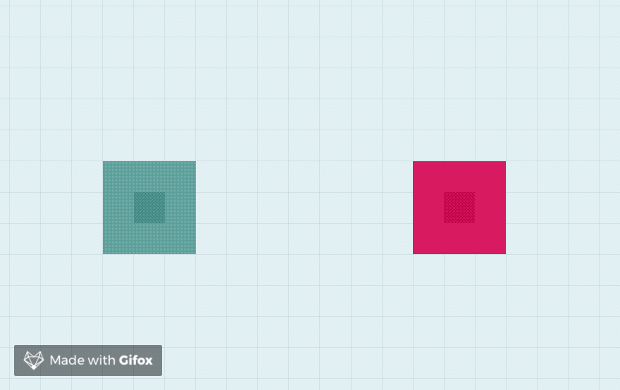

## Граничные случаи

В данном документе описаны граничные случаи в игре Paper IO (соревнование AiCups #4).

#### 1. Одновременное пересечение шлейфа

* **Что происходит?** Два и более игрока одновременно (то есть, в один и тот же тик) догоняют чужие шлейфы и пересекают их.
* **Что в итоге?** Все, чей шлейф был пересечён, умирают. За тик со смертью игрокам не начисляют баллов (поэтому у обоих по нулю баллов).
* **Как это выглядит?**
 

#### 2. Попытка закрасить одну и ту же территорию

* **Что происходит?** Два и более игрока одновременно (то есть, в один и тот же тик) закрашивают одну и ту же территорию. Причём ни один из игроков на данной территории не находится и в конце все остаются в живых.
* **Что в итоге?** Территория, на которую в один и тот же тик претендуют несколько игроков, остаётся ничейной. При этом баллы за неё получат оба, как будто у обоих получилось её закрасить.
* **Как это выглядит?**
 

#### 3. Убийство закрашиванием

* **Что происходит?** Первый игрок (зелёный) поглощает клетку, на которой в данный момент стоит второй игрок (красный). Наличие у второго игрока внешней территории (то есть, не подпадающей под закраску) не влияет на исход.
* **Что в итоге?** Закрашенный игрок умирает, а тот кто закрасил получает очки и за убийство и за закрашенную территорию.
* **Как это выглядит?** 

#### 4. Попытка закраски внутри чужой закраски

* **Что происходит?** Два игрока одновременно закрашивают одну и ту же территорию. Причём один из игроков (красный) оказался на закрашиваемой территории другого (зелёного). 
* **Что в итоге?** Игрок, который в момент чужой закраски оказался на ней, погибает, даже если в этот момент закрашивает сам. При этом умерший не получает ни новой территории ни баллов и никакие клетки не считаются спорными (то есть, отходят закрасившему игроку).
* **Как это выглядит?**

#### 5. Попытка выжить, пересекая шлейф

* **Что происходит?** Первый игрок (зелёный) пытается "поймать" второго игрока (красного) в свою закрашиваемую область. Второй пытается из неё "удрать" и в момент закраски пересекает шлейф противника.
* **Что в итоге?** Закраска в данном случае считается более приоритетной, чем пересечение шлейфа. Поэтому "пойманный" игрок погибает, и считается, что шлейф он не пересёк.
* **Как это выглядит?**

#### 6. Попытка пересечь шлейф во время чужой закраски

* **Что происходит?** Первый (красный) игрок занимается захватом территории. Второй игрок (зелёный) захотел на него "напасть" и пересечь его шлейф. Затем происходит одновременное пересечение шлейфа и закраска области. В отличие от случая 5, пересечение шлейфа происходит извне закрашиваемой области.
* **Что в итоге?** Захват области первым игроком проходит успешно. Считается, что шлейф пересечь не успели, поэтому второй игрок продолжит движение по закрашенной противником области. 
* **Как это выглядит?**

