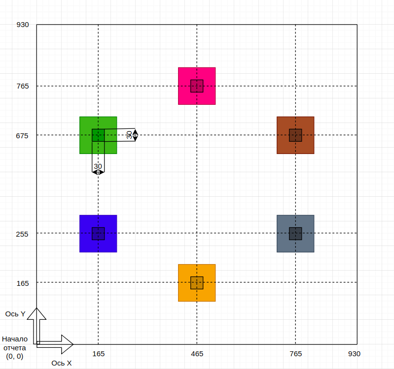
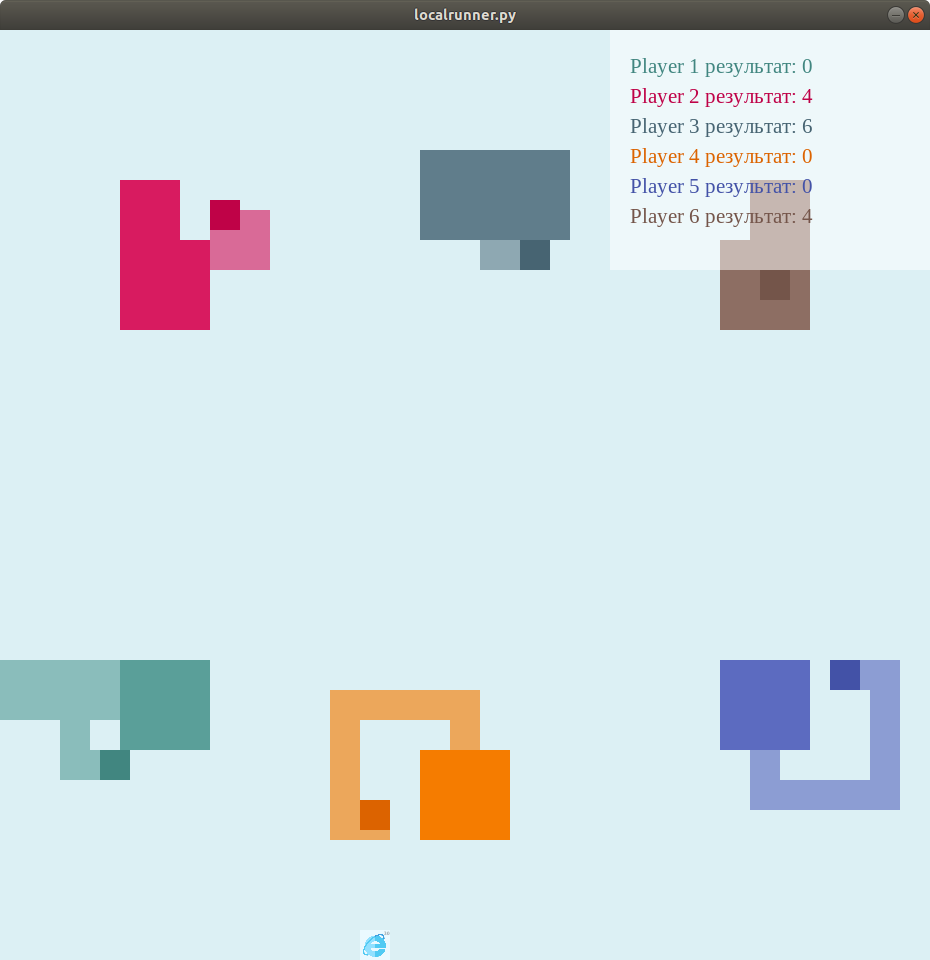

# Правила участия в AiCups 4

Соревнование среди создателей искусственного интеллекта стартует в четвертый раз. На этот раз предлагаем вам написать своего **бота**, который сойдется в сложной битве против других ботов в игре по мотивам [Paper.io](http://paper-io.com/).

Мероприятие проводится на специально разработанной онлайн-платформе [AiCups](http://aicups.ru/), где участники регистрируются, могут отправлять решения, стартовать игры и узнавать актуальные новости. 

Каждая игра принадлежит к классу рейтинговых, либо нерейтинговых. Нерейтинговые игры участники стартуют сами, они предназначены лишь для оценки собственных сил и отладки написанных ботов в боевом окружении. Рейтиновые игры система время от времени стартует самостоятельно, подбирая участников по алгоритму **TrueSkill**. По результатам рейтинговых игр формируется итоговый рейтинг и определяются победители. Каждая **игра** запускается на серверах организатора в изолированном окружении. 

Действия, которые будут представлять риск нанесения ущерба проверяющей системе, будут рассматриваться как нарушение данных правил и приведут к дисквалификации участника.

Решения можно присылать на любом языке программирования из списка поддерживаемых:

* C#         .zip,.cs
* C++11      .zip,.h,.cpp
* C++14      .zip,.h,.hpp,.cpp
* C++17      .zip,.h,.hpp,.cpp
* Elixir     .zip,.ex
* Go         .zip,.go
* Haskell    .zip,.hs
* Java1.8    .zip,.java
* Java1.9    .zip, .java
* Kotlin     .zip,.kt
* Node JS    .zip,.js
* PHP7       .zip,.php
* Python 2.7 .zip,.py
* Python 3.6 .zip,.py
* Rust       .zip,.rs
* Scala      .zip,.scala
* Swift      .zip, .swift

Детальные инструкции по созданию своего решения, формату входных и выходных данных, сопутствующих пакетах и библиотеках можно прочитать в [разделе 2](#2-создание-решения). После того как решение было загружено и обработано, его результат можно посмотреть в визуализаторе на сайте. Попутно будут выводиться отладочный вывод и случившиеся ошибки.

Для удобства участников, а также для снижения пиковых нагрузок на систему запуска, мы подготовили программу для локального запуска и отладки — **Local Runner** (далее обозначается как **LR** или **ЛР**). Она написана на Python 3.6 с использованием визуализатора Pyglet и поставляется в виде исходных кодов. Детальные инструкции по настройке и использованию Вы найдете в [разделе 3](#3-особенности-запуска-local-runner).

Гайд по быстрому старту находится в файле [QUICKSTART.md](QUICKSTART.md).

С организаторами соревнования можно связаться:

* в группе Telegram [@aicups](https://t.me/aicups)
* с помощью формы обратной связи на сайте соревнования  

Все числовые параметры, которые вы встретите ниже, даны как примеры. В каждой конкретной игре параметры могут быть немного изменены, что повлияет на игровой баланс и физику мира. Таким образом мы получаем более справедливый и предсказуемый рейтинг раундов. Конкретные параметры игры будут присылаться **боту** перед первым тиком (см. раздел 2).

Удачи!

## 1. Описание механики

Игровой мир представляет собой квадрат со сторонами 930 на 930 условных единиц. Начало отсчета расположено в левом нижнем углу. Весь игровой мир разбит на 31*31 элементарных ячеек, размером 30 на 30. Все координаты в мире целого типа.
Суть игры крайне проста - вы играете за умный квадрат, постоянно находящийся в движении, направление движения которого вы можете менять. Также у вас есть небольшая территория, которую можно расширить, путем захвата новых клеток. За захват новых клеток и за некоторые другие игровые действия будут начисляться очки. Остальные игровые объекты, концепции и взаимодействия будут описаны ниже. 



Как можно увидеть из рисунка, все боты равноудалены от ближайшей к ним границе и находятся на одинаковом расстоянии от двух ближайших к ним противников.

Одновременно на одной карте соревнуются **шесть ботов**, созданных участниками соревнования. Каждому **боту** соответствует игровой объект типа "Игрок". Игра продолжается либо до смерти всех игроков, либо до максимального числа тиков (параметр конфигурации MAX_TICK_COUNT). Каждый тик выполняется по чёткой схеме:
 * **ботам** передаётся состояние мира и в ответ ожидается **одна из команд - "left", "right", "up", "down"** ("right" - направление в сторону увеличения x, "left" - направление в сторону уменьшения x);
 * каждая полученная команда тут же будет применена;
 * при получении всех команд просчитывается новое состояние мира;
 * за определенные игровые действия начисляются игровые очки и тот, кто наберет наибольшее количество очков к концу игры - станет победителем.

### 1.1. Игровые объекты и концепции

1. **Игрок** - двигающийся квадрат, который управляется **ботом** участника. Положение квадрата на карте определяется координатами его центра (x, y). Скорость квадрата задается параметром SPEED и может быть на время изменена, путем взятия бонуса.

2. **Территория** - захваченная ботом область карты, на которой бот находится в относительной безопасности. Территория может состоять из нескольких несвязанных частей. Так может получиться, например, из-за действий противников.

3. **Шлейф** - пройденный игроком путь, вне своей территории. При возвращении игрока на свою территорию, все клетки между шлейфом и территорией, добавляются к территории игрока. При пересечении шлейфа другими игроками или при самопересечении своего шлейфа, игрок выбывает из игры, а захваченная им территория становится нейтральной.

4. **Бонус** - в игре имеется 3 вида бонусов - **Ускорение**, **Замедление** и **Пила**:
   * **Ускорение** - увеличивает скорость игрока на несколько клеток. Количество клеток может быть любым, в диапазоне от 10 до 50;
   * **Замедление** - уменьшает скорость игрока на несколько клеток. Количество клеток может быть любым, в диапазоне от 10 до 50;
   * **Пила** - выстреливает лучом в направлении движения игрока. Применяется мгновенно. При пересечении лучом территории соперника, вся территория, противоположная положению соперника относительно данного луча, станет нейтральной. При пересечении лучом положения соперника, соперник выбывает, а вся его территория становится нейтральной.

### 1.2. Игровые взаимодействия

1. **Управляемое движение** осуществляется в 4 возможных направления. Движение в обратном направлении невозможно, и при получении системой данной команды, она будет проигнорирована. Движение осуществляется при помощи прибавления к текущей координате игрока значения SPEED каждый тик. При нахождении в состоянии перемещения между двумя клетками, поворот невозможен;

2. **Захват территории** - осуществляется в момент возвращения на свою территорию с нейтральной либо вражеской. В этот момент все клетки внутри шлейфа присоединяются к территории игрока. В случае территории из нескольких частей шлейф игрока и границы его территории могут не образовывать замкнутую фигуру. Тогда к территории игрока будут добавлены только клетки пройденного пути;

3. **Разрезание шлейфа** - при разрезании шлейфа противника, вам начисляются дополнительные очки, а противник выбывает из игры. При разрезании собственного шлейфа игрок выбывает из игры;

4. **Столкновение с другим игроком** - при столкновении с другим игроком, проигрывает тот игрок, чей шлейф длиннее, при совпадении длин шлейфов, проигрывают оба игрока;

5. **Взятие бонуса** - возможно двумя способами: 1) при прохождении по клетке бонуса 2) при захвате клетки, на которой есть бонус. Если бонус появился на территории игрока, то он не будет применен, и для его взятия необходимо пройти по клетке с ним;

6. **Пересечение границы** - приводит к выбыванию из игры.


### 1.3. Условия победы

Игра продолжается либо до смерти всех игроков, либо до максимального числа тиков (параметр конфигурации MAX_TICK_COUNT).

Очки присваиваются за определенные игровые действия:
* Захват одной нейтральной клетки - 1 балл;
* Захват одной клетки противника - 5 баллов;
* Отрезание пилой территории противника - 30 баллов;
* Пересечение шлейфа противника - 50 баллов;
* Убийство противника пилой - 150 баллов;

Причины выбывания игрока из игры:
* При пересечении шлейфа другими игроками или при самопересечении своего шлейфа;
* При столкновении с другим игроком, проигрывает тот игрок, чей шлейф длиннее, при совпадении длины шлейфа, проигрывают оба игрока;
* При пересечении границ карты (с учётом размеров игрока);
* При захвате противниками всей вашей территории;
* При попадании лучом в игрока

Побеждает игрок, набравший наибольшее количество очков.


## 2. Создание решения

Решение пользователя - это программа-бот, которая взаимодействует с сервером через потоки стандартного ввода-вывода. Она может быть написана на любом языке из списка поддерживаемых. Для некоторых языков будут доступны стандартная библиотека, библиотека для разбора JSON, и дополнения, предложенные участниками.

Решение предоставляется участником на сайте соревнования как ZIP-архив, внутри которого обязательно есть файл с названием main, корректный для выбранного участником языка программирования. Последнее включает в себя:

* корректное расширение (`.py` для Python, `.cpp` для С++ и т. д.);
* корректный синтаксис (к примеру, внутри С++ должна быть функция `main()`);
* корректные подключения других модулей/пакетов выбранного языка.

После загрузки решение будет сначала скомпилировано (для компилируемых языков: C++, Go, Java, C#), а затем запущено в специальном docker-контейнере. Взаимодействие решения с внешним миром происходит происходит через потоки стандартного ввода/вывода.

**Внимание!** Использование `stderr` является ошибкой. Кроме того, в файле стратегии должны отсутствовать логгеры, записывающие информацию в файл, иначе поведение вашей стратегии будет существенно отличаться от поведения на сервере.

### 2.1. Архитектура решения
Самое простое решение на языке программирования Python 3 будет состоять из одного файла `main.py`. Программа-клиент инициирует сессию и запускает этот скрипт в начале работы. Клиент скрывает внутри себя работу с сетью и обработку ошибок, и является посредником между игровой механикой и решением участника. Он передает JSON от мира в стандартный поток ввода (`stdin`) и забирает ответ из стандартного потока вывода (`stdout`) (для Python это `sys.stdin` и `sys.stdout`). Напомним, что для корректной работы решение должно запускаться с параметрами для ввода/вывода без буфера (для Python это флаг `-u` при запуске интерпретатора).

Максимальный размер файла стратегии — `20` Мб.

Решение стартует один раз и далее работает в бесконечном цикле. Обрабатывать остановку не обязательно, в конце игры `dockerd` завершит работу всех контейнеров. Внутри цикла заключается обработка ввода/вывода, происходит обработка JSON и вызов главного обработчика (пример простой стратегии на Python):

```python
import json
import random

config = input() # получение конфигурации игры
    
while True:    
    state = input()  # получение тика
    commands = ['left', 'right', 'up', 'down']  # доступные команды
    cmd = random.choice(commands)  # случайный выбор действия
    print(json.dumps({"command": cmd, 'debug': cmd}))  # отправка результата
```

После старта игры, сервер-механика рассылает всем подключившимся решениям конфигурацию игры. В неё входят следующие параметры:
* `type` — `start_game`
* `params` — параметры игрового мира
    * `x_cells_count` — количество элементарных ячеек по оси x
    * `y_cells_count` — количество элементарных ячеек по оси y
    * `speed` — скорость игрока
    * `width` — ширина и высота элементарной ячейки

Формат тика:
* `type` — `tick`
* `params` — параметры игрового мира
    * `players` — словарь, где ключ - идентификатор игрока, а значение - его состояние. Ключ - это либо id противника (случайное и постоянное для данной игры число), либо строка 'i' - идентификатор данного игрока. Формат состояния:
        * `score` — количество очков игрока
        * `territory` — массив координат клеток, принадлежащих территории игрока
        * `position` — текущее положение игрока
        * `lines` — массив координат клеток шлейфа
        * `direction` — направление движения игрока ("left", "right", "up", "down")
        * `bonuses` — массив активных бонусов игрока
            * `type` — тип бонуса ('n' - Ускорение (Нитро), 's' - Замедление, 'saw' - Пила) 
            * `ticks` — сколько еще клеток будет активен бонус
    * `bonuses` — массив бонусов, расположенных на карте
        * `type` — тип бонуса ('n' - Ускорение (Нитро), 's' - Замедление, 'saw' - пила) 
        * `position` — координаты бонуса, массив из двух элементов - (x, y)
    * `tick_num` — номер тика

Ответ на один тик не должен превышать `REQUEST_MAX_TIME = 5` секунд. Суммарное время ответов на всю игру не должно превышать `MAX_EXECUTION_TIME = 120` секунд.

Сообщение об окончании игры:
* `type` — `end_game`
* `params` — {}


### 3. Особенности запуска Local Runner

Local Runner написан на языке программирования Python версии 3.6. Для запуска потребуется интерпретатор Python версии 3.6 или новее. Local Runner нужен для демонстрации и тестирования механики игры, при помощи него игроки могут пробовать свои решения на собственном компьютере. Аналогичный код работает у нас на серверах для запуска игровых сессий.

Интерфейс программы можно увидеть на рисунке ниже:



В папке `examples` можно найти примеры простых стратегий на различных языках программирования. Их поведение определяется случайным выбором одной из доступных команд. Запустить Local Runner можно командой `python localrunner.py` при условии, что установлены все зависимости из `requirements.txt`.

Аргументы, которые можно передать в Local Runner:
* `-h` или `--help` — показать справку
* `-p1` или `--player1` — **команда для запуска исполняемого файла стратегии игрока 1 (аналогично для остальных игроков, к примеру -p3 и --player3)**, максимальное количество игроков - 6. Для игры с клавиатуры, можно в качестве значения передать строку 'keyboard'. Для запуска простой стратегии-заглушки можно передать строку 'simple_bot'.
* `--p1l` — путь к логам игрока 1 (аналогично для остальных игроков, к примеру -p3l)
* `-t` или `--timeout` — по умолчанию игра прекращается после количества тиков, равного MAX_TICK_COUNT. Чтобы отключить данное поведение, передайте ранеру аргумент -t off.

Примеры запуска при установленном python3 вместе с зависимостями:
* ```$ python3 localrunner.py``` — запуск игры одним игроком с управлением с клавиатуры;
* ```$ python3 localrunner.py -p1 "python strategy.py"``` — запуск с явным указанием первого решения на python, лежащего в той же папке;
* ```$ python3 localrunner.py -p1 "java -jar /maic3/strategy.jar"``` — запуск решения на Java, лежащего по абсолютному пути в условной папке `/maic3/`;
* ```$ python3 localrunner.py -p1 "java -jar ../strategy_1/solution.jar" -p2 "../strategy_2/solution.exe"``` — запуск двух стратегий по относительному пути в папке на один уровень вверх;
* ```$ python3 localrunner.py -p1 "python strategy.py" -p2 simple_bot``` — запуск решения игрока вместе с простой стратегией;
* ```$ python3 localrunner.py -p1 "python strategy.py" -p2 keyboard``` — игра с клавиатуры вместе со своим решением;
* ```$ python3 localrunner.py -p1 "node strategy.js" -p2 simple_bot -p3 simple_bot -p4 simple_bot -p5 simple_bot -p6 simple_bot``` —  запуск решения игрока вместе с 5ю простыми стратегиями-заглушками;

**Внимание!** Под командой запуска подразумевается полная команда, используемая для исполнения решения-стратегии. Частой ошибкой участников является попытка использовать, например, `main.py` вместо `python main.py` или `main.cs` вместо пути к скомпилированному бинарному файлу.

**Внимание!** При использовании аргументов `-p{num}` или `--player{num}` каждому `num` будет соответствовать неизменное первоначальное положение игрока. На сервере начальные положения игроков распределяются случайным образом.

**Важно!** Не стоит забывать про буферизацию ввода/вывода в используемом инструментарии (например, интерпретатору python нужно передать флаг `-u` или выставить соответствующую переменную окружения). Без этого корректная работа не гарантируется.

Пользователи Windows могут столкнуться с проблемой, когда интерпретатор языка программирования установлен не совсем верно, и его нет в системной переменной `PATH`. В таком случае необходимо указывать полный путь к интерпретатору вашего языка или добавлять его в `PATH`.

## Спасибо, что участвуете в наших чемпионатах!
